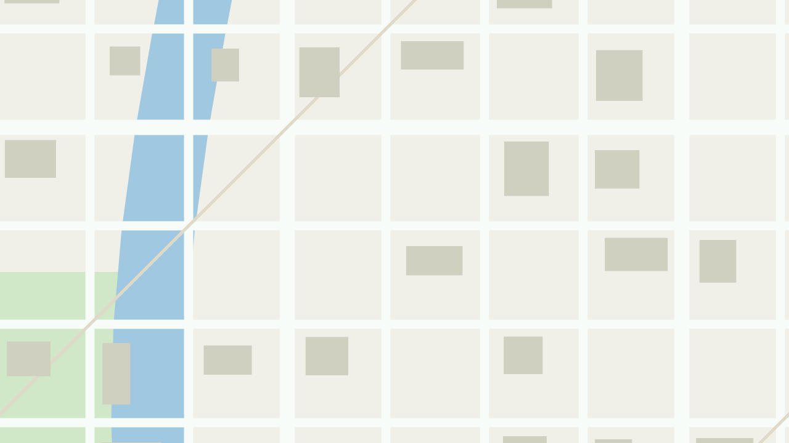

# Aimless Moving Map *for M5Tab5*

An offline moving map for the M5Stack Tab5 with the M135 GNSS module:
vector tiles from Protomaps PMTiles archives on the card, drawn on the
device, with your position on them. You know where you are; where you
are going is your own business.



*Not a photo and not a real place: the test fixture's made-up streets,
river and parks, drawn on a PC by the same code the firmware runs, in
the 1280 x 720 window the screen shows. The status bar and the position
marker are drawn on top of this on the device.*

A port of
[m5tab5_m135_gnss_protomaps_live_area_map](https://github.com/Sudrien/m5tab5_m135_gnss_protomaps_live_area_map),
kept unchanged in `original/` for reference, to plain ESP-IDF with no
Arduino core and no M5Unified, on three libraries pulled out of
[Defeatist Music Player for M5Tab5](https://github.com/Sudrien/defeatist-music-player-for-m5tab5):

| Library | For |
|---|---|
| [feckless-drivers-for-m5tab5](https://github.com/Sudrien/feckless-drivers-for-m5tab5) | the I2C bus and IO expanders, the USB host |
| [feckless-graphics-handler-for-m5tab5](https://github.com/Sudrien/feckless-graphics-handler-for-m5tab5) | the panel, the framebuffer, text |
| [feckless-storage-handler-for-m5tab5](https://github.com/Sudrien/feckless-storage-handler-for-m5tab5) | the microSD card and USB drives |

## Status: milestone 1

What works:

- Every `.pmtiles` file in the root of the card or a USB drive is opened,
  and each tile is drawn from whichever archive covers it.
- The position from the M135, followed as it moves, at zoom 14.
- A marker, blue with a good 3D fix and grey with a rough one, and a
  status line with position, satellites, HDOP, speed and UTC.
- Before the first fix, the map shows the first archive's centre, with
  no marker.

Not yet: tiles over the network, labels, other zooms, the compass,
waypoints, the Wi-Fi setup page. See `ARCHITECTURE.md`.

## Maps

Protomaps basemap extracts, MVT tiles, gzip-compressed: what
`pmtiles extract` produces from a Protomaps daily build. Zoom 14 must be
in them. The card must be **FAT32**, so each file is under 4 GB; split a
large area into bands with `original/plan-extracts.py`. exFAT, and one
planet-sized file, need a patched FatFs and come later.

## Building

ESP-IDF 5.5 or later:

```
idf.py set-target esp32p4
idf.py build flash monitor
```

Rev 2 Tabs (ST7121 panel) only; see feckless-graphics-handler.

## Tests

```
make -C test
```

The map pipeline on a synthetic archive, the grid that follows the
position, the tile cache and the order tiles are looked for in, and the
NMEA parser. Only a C compiler is needed;
`test/make_fixture.py` regenerates the archive.

## Licence

MIT. See `LICENSE`. Map data on your card is the map provider's, under
its own licence (for Protomaps builds, OpenStreetMap's ODbL).
